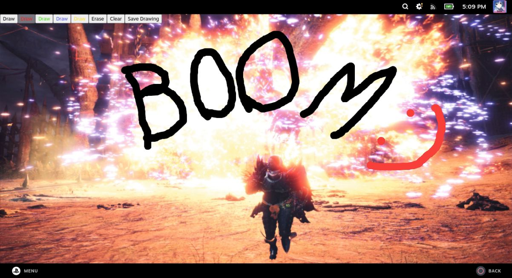
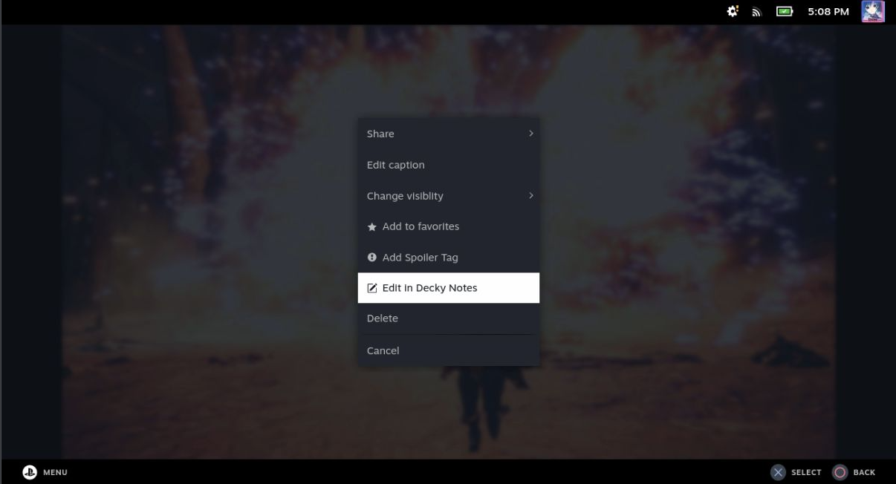

# Decky Notes

Make notes and draw over your screenshots

## How it works

This plugin will let you through media library (screenshots) and use them as a background for your new notes.
Notes will be saved in `~/Pictures/decky-notes`.

## Features

### Whiteboard

Draw over your screenshots!

### Edit button in media menu

Edit screenshot directly from media screen

### Gallery

Look through your existing notes
